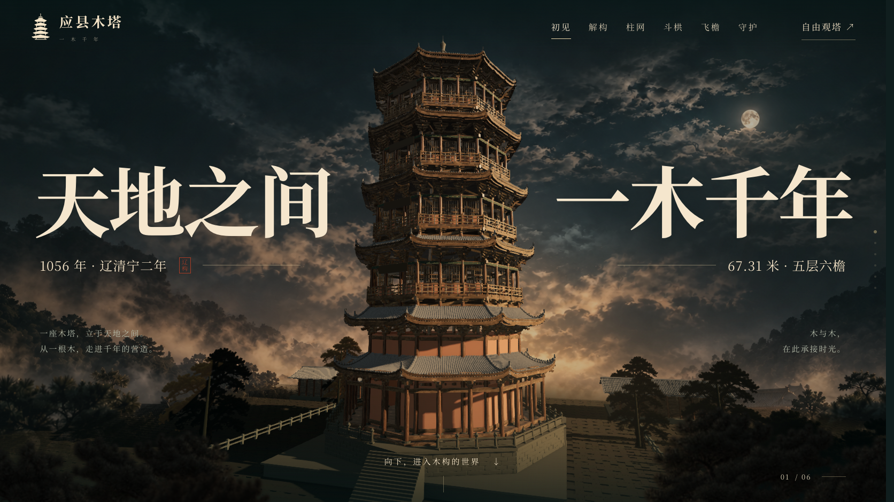

# 应县木塔 · 一木千年

六幕连续滚动的 3D 科普网站，包含斜向拆层、柱网展示、斗栱近景、飞檐归位和自由观塔。



## 本地运行

需要 Node.js 22.12 或更新版本。

```sh
cd yingxian-pagoda
npm ci
npm run dev
```

构建：`npm run build`。将生成的 `yingxian-pagoda/dist` 部署在站点根目录。`alignment.html` 为最新六幕光影与排版对照页，`quality.html` 保留第九版试验。

## 完整下载

[版本附件](https://github.com/huangbai-AI/yingxian-pagoda/releases/tag/v9) 提供网站成品、可编辑 Blender 模型、通用模型和渲染样片的完整压缩包。解压后可运行启动脚本。

仓库保留网站源码、网页用模型、纹理、字体、设计参考及建模脚本。体积较大的 Blender 文件、通用模型和网站成品保存在版本附件中。

## 当前版本

第十一版补建台基石栏、分块砌石、木地板和配殿，调整院落铺地与植被。第三幕降低俯视角度，斗栱改从另一侧取景，第五幕放大并移向左侧，第六幕放大整塔并保留台基。背景按篇章校色，保留连续滚动和自由观塔。

可编辑新模型位于本地交付的 `model/应县木塔_环境精修.blend`；仓库包含网页用模型和重建脚本 `model/精修台基与楼板.py`。使用 v9 附件里的 `应县木塔.blend` 打开后运行该脚本可生成新版模型；再在网站目录运行 `node scripts/compress-refined.mjs`。GitHub 的 v9 附件仍是第九版完整交付。

网页仍为实时渲染；对照页中的两张预渲染样片属于上一轮试验，尚未生成完整滚动影片。模型是科普展示性重建，并非文物测绘模型，与设计参考仍有细节差异。

详细使用方式及素材来源见 [使用说明](使用说明.md)。木纹素材来自 Poly Haven，采用 CC0 许可。
